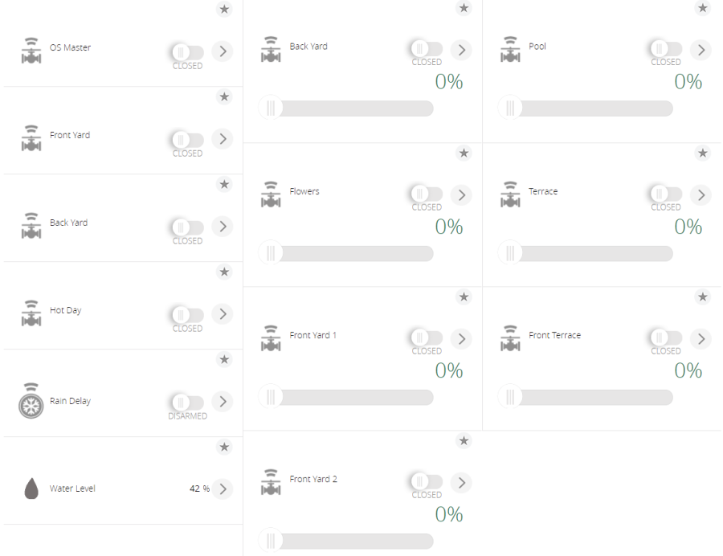

# OpenSprinkler plug-in for Vera and openLuup
This is a completely new and rewritten plug-in to interface an OpenSprinkler to a Vera or openLuup system.

It can discovery and control:
- Programs (turn on/off)
- Zones (turn on/off, length in minutes using a dimmer)
- Rain Delay and other attached sensors



All the devices are implemented as standard Vera device types.

In particular, I need help with
- ~~controller with a lot of zones (16/32+)~~
- ~~controller with master valve~~
- ~~controller with rain sensors~~
- support for scenes

# Installation via MiOS App Store
The plug-in is available via MiOS App Store. Plug-in ID is 9301 if you want to install it manually.

Go to your Vera web interface, then Apps, Install Apps and search for "Vera OpenSprinkler Plug-in". Click Details, then Install.

# Installation via AltAppStore
The plug-in is available via AltAppStore. Just search for it.

# Manual Installation
To install, simply upload the files in this directory (except readme) using Vera's feature (Go to *Apps*, then *Develop Apps*, then *Luup files* and select *Upload*) and then create a new device under Vera.

To create a new device, got to *Apps*, then *Develops*, then *Create device*.

Every time you want to map a new controller, just repeat this operation.

- Upnp Device Filename/Device File: *D_VeraOpenSprinkler1.xml*
- Upnp Implementation Filename/Implementation file: *I_VeraOpenSprinkler1.xml*
- Parent Device: none

After installation, ensure to change the "IP" variable under the master device (if not specified before).
This is the OpenSprinkler Controller internal IP address (host name are supported too) and port (omit if 80, otherwise use format *IP:port*).

Password is set to "opendoor" (in MD5 format), but you need to change it (see next part).

Reload your Vera's engine (ie by executing *luup.reload()* in *App*, *Develop apps*, *Test luup code*) and wait for your zones and programs to appear.

# Password
OpenSprinkler use MD5-hashed passwords. Ensure to use a tool (such as http://www.md5.cz/) and save the generated password in the corresponding variable.

# Legacy mode
This plug-in is suited for the latest firmware version of OpenSprinkler. If you're stuck on version >= 2.1.3 and < 2.1.9, try to set *LegacyMode* variable under the master device to 1 and then do a Luup reload.

# Variables
## For master device
- *urn:bochicchio-com:serviceId:OpenSprinkler1* / *DebugMode*: set to 1 to have verbose logging
- *urn:bochicchio-com:serviceId:OpenSprinkler1* / *Password*: set your MD5 password (default is *opendoor*, already setup at startup)

## For zones and programs
- *urn:bochicchio-com:serviceId:OpenSprinkler1* / *UpdateNameFromController*: 0 if you want to override the device name and never sync it with controller, 1 to sync it if changed (default)

## For Water Level
This is a standard humidity service, so you can get its value using the standard *urn:micasaverde-com:serviceId:HumiditySensor1* / *CurrentLevel* variable.

## For sensors
Sensors are standard security service device, so you can get its value using the standard *urn:micasaverde-com:serviceId:SecuritySensor1* / *Tripped* variable.

# Use in code
Master, Zones and Program devices implements standard switch action: *urn:upnp-org:serviceId:SwitchPower1 SetTarget*

Master, Zones and Program devices implement standard HA action for toggle state: *urn:micasaverde-com:serviceId:HaDevice1 ToggleState*

Zone devices implement standard dimmers action: *urn:upnp-org:serviceId:SwitchPower1 SetTarget*

Master has support to set Rain Delay via *urn:bochicchio-com:serviceId:OpenSprinkler1 SetRainDelay* passing *newRainDelay* (date and time in epoch format).

# Discovery of new devices
Starting from version 1.3, discovery of devices is done only on the first run. If you want to force it again, set *Configured* to *0*.

Discovery is automatically performed each time the plug-in version is updated.

You can also force it by calling *Reconfigure* on service *urn:micasaverde-com:serviceId:HaDevice1*.

```
luup.call_action("urn:micasaverde-com:serviceId:HaDevice1", "Reconfigure", {}, masterID)
```

# Debug
If you want to see more debug info, set *DebugMode* variable on the master device to *1*. No need to reload luup engine. Just set back to 0 if you want to disable verbose logging.

# OpenLuup/ALTUI
The devices are working and supported under OpenLuup and AltUI. In this case, if you're using an old version of AltUI, just be sure the get the base service file from Vera (automatically done if you have the Vera Bridge installed).

### Support
Before asking for support, please:
 - change *DebugMode* variable to 1 (on the device itself, not on the master)
 - repeat your problem and capture logs
 - logs could be captured via SSH or by navigating to `http://VeraIP/cgi-bin/cmh/log.sh?Device=LuaUPnP`. [More Info](http://wiki.micasaverde.com/index.php/Logs)

If you need help, visit [SmartHome.Community](https://smarthome.community/) and tag me (therealdb).